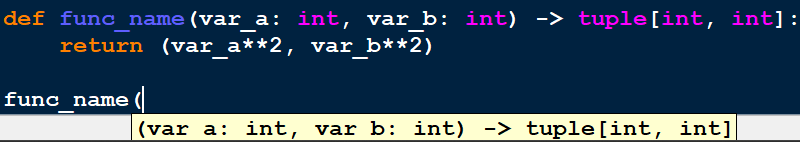

# Harnessing the Power of Type Annotations in Python: A Comprehensive Guide


## Introduction:

In recent years, Python has evolved beyond its reputation as a dynamically typed language. With the introduction of type annotations in Python 3.6, developers gained a powerful tool to enhance code readability, maintainability, and reliability. Type annotations allow programmers to specify the expected types of variables, function parameters, and return values. This article explores the use of type annotations in Python, covering their benefits, syntax, and practical examples.

## Understanding the Divide: Typed vs. Untyped Programming Languages

Before we delve into use of Type annotations in Python, lets quickly understand what Types or Untyped languages are and how the stack against each other. Typed and untyped languages refer to the categorization of programming languages based on how they handle data types.

### Typed Languages:

In typed languages, variables are associated with specific data types, and these types are enforced by the compiler or interpreter. There are two main categories of typed languages:

1. **Statically Typed Languages**: In statically typed languages, variable types are checked at compile time. This means that the data type of each variable must be known at compile time, and any type errors are caught before the program is executed. Examples of statically typed languages include Java, C, C++, and Swift.
2. **Dynamically Typed Languages:** In dynamically typed languages, variable types are checked at runtime. This means that variables can hold values of any type, and type checking occurs as the program runs. Dynamically typed languages provide more flexibility but may result in runtime errors if type mismatches occur. Examples of dynamically typed languages include Python, JavaScript, Ruby, and PHP.

### Untyped Languages:

Untyped languages, also known as dynamically typed languages, do not enforce any type constraints on variables. In these languages, variables can hold values of any type, and type checking is minimal or non-existent. While this flexibility can make code shorter and more concise, it also increases the risk of type-related errors. Examples of untyped languages include Lisp, Scheme, and Smalltalk.

### Comparison Types v/s Untyped:

1. Typed languages offer stronger type checking, which can catch errors at compile time and lead to more robust code.
2. Untyped languages provide greater flexibility and may lead to more concise code, but they can also be prone to type-related errors that are only discovered at runtime.
3. Typed languages are often preferred for large-scale projects and systems where reliability and maintainability are paramount, while untyped languages may be favored for rapid prototyping and scripting tasks where flexibility and simplicity are valued.

In summary, the choice between typed and untyped languages depends on the specific requirements of the project, the preferences of the development team, and the trade-offs between type safety, flexibility, and ease of development.

## Python: Type Annotations

Remember, type annotations are a form of documentation and are not enforced at runtime by Python itself. However, type annotations are very useful for tools like type checkers, IDE's and increases the overall readability of code, itself.

```python
# just declare the variable
<variable_name>: <var_type>  # assign the var later but declare type now

# declare the variable and assign a value
<variable_name>: <var_type> = value
```

```python
# Basic variable type annotations
count_1: int
count_2: int = 0

is_day_1: bool
is_day_2: bool = True

price_1: float
price_2: float = 9.99

str_1: str
str_2: str = "Python"

# Type annotations while declaring functions
def func_name(var_a: int, var_b: int) -> tuple[int, int]:
    return (var_a**2, var_b**2)
```



Apart from improving the readability of code, type annotations also help by showing the contex thelp. In Python Idle (as shown in the screenshot) and a lot of other IDE's, when a function defined using type annotations is called, user gets a context help for expectations of the function arguments and also the return type.

## Benefits of Type Annotations:

1. **Improved Code Readability**: Type annotations make it easier for developers to understand the intended usage of variables and functions within the codebase.
2. **Enhanced Maintainability**: By explicitly declaring types, developers provide valuable documentation for future maintenance and debugging efforts.
3. **Early Detection of Errors**: Type annotations can help catch type-related errors at compile-time or during static analysis, reducing the likelihood of runtime exceptions.
4. **Facilitates IDE Support**: Many integrated development environments (IDEs) and code editors leverage type annotations to offer features such as auto-completion and type checking.

## Syntax of Type Annotations:

In Python, type annotations are expressed using a colon (`:`) followed by the desired type. Some basic type annotations would go as below:

```python
# Basic variable type annotations
count: int = 0
is_required: bool = True
price: float = 9.99
manager_name: str = "Alice"
```

The `typing` module provides a range of built-in types and utilities to facilitate type annotations.

Example:

```python
from typing import List

def greet(name: str) -> str:
    return f"Hello, {name}!"

def process_numbers(numbers: List[int]) -> int:
    return sum(numbers)
```

In this example:

- The function `greet` takes a parameter `name` of type `str` and returns a `str`.
- The function `process_numbers` accepts a list of integers (`List[int]`) and returns an integer.

## Type Annotations in Practice:

Let's explore some real-world scenarios where type annotations can be beneficial:

1. **Collaborative Development**:

   - When working on a team project, type annotations serve as a form of communication between developers, clarifying the expected types of inputs and outputs for functions.
2. **API Documentation**:

   - Type annotations provide valuable documentation for APIs, helping users understand how to interact with functions and methods effectively.
3. **Static Analysis Tools**:

   - Tools such as MyPy leverage type annotations to perform static type checking, identifying potential errors before runtime.

## Quotes from Python Community:

- Guido van Rossum, Python's creator, on type annotations:

  > "Type annotations help bring the benefits of static typing to Python without sacrificing its dynamic nature."
  >
- Raymond Hettinger, Python core developer, on code readability:

  > "Type annotations make Python code more self-documenting and easier to understand, especially for newcomers to the language."
  >

## Conclusion:

Type annotations represent a significant step forward in the evolution of Python, enabling developers to write more robust and maintainable code. By embracing type annotations, programmers can leverage the benefits of static typing while retaining Python's flexibility and expressiveness.

### In summary, type annotations:

- Enhance code readability and maintainability.
- Facilitate early error detection.
- Support collaborative development and API documentation.
- Empower static analysis tools for improved code quality.

As Python continues to evolve, type annotations remain a valuable tool for developers seeking to write cleaner, more reliable code.
