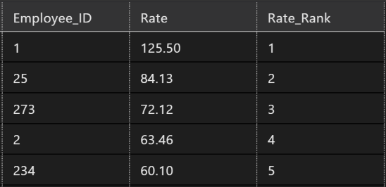
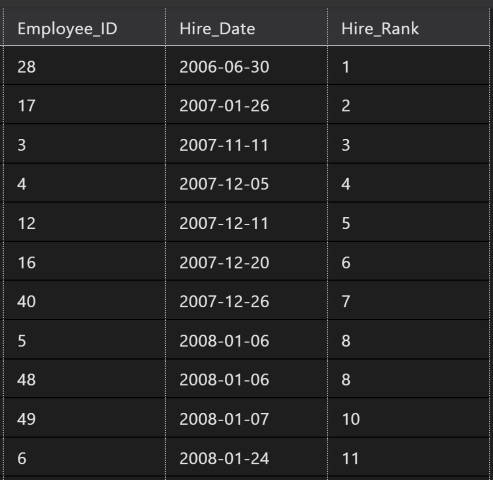
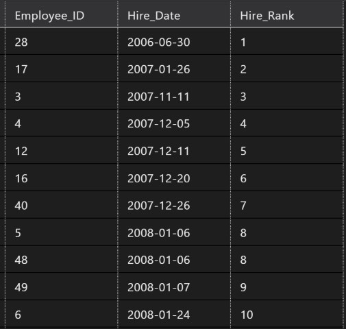
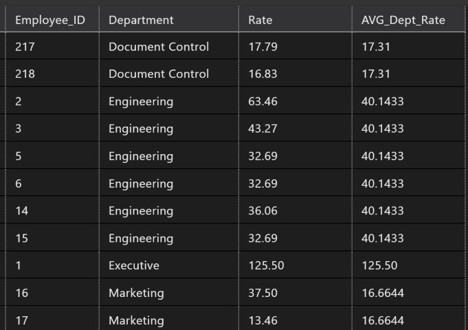
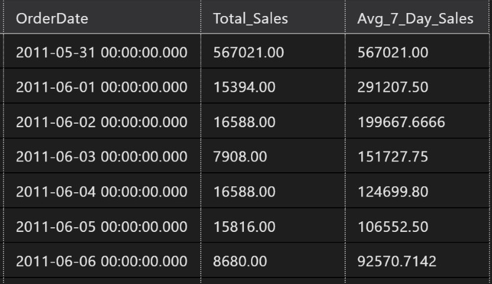
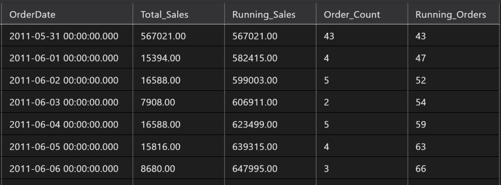

# Unleashing the Power of SQL Window Functions: A Comprehensive Guide

In the realm of data analysis and database management, SQL (Structured Query Language) stands tall as the lingua franca. Within its arsenal lies a potent weapon known as Window Functions, often underutilized yet capable of unlocking a treasure trove of insights from your datasets. In this comprehensive guide, we delve into the essence of SQL Window Functions, exploring their purpose, mechanics, and practical applications through illustrative examples.

### Understanding the Concept:

At its core, a '***Window Functions***' allows you to perform calculations across a specified set of rows that are related to the current row. Unlike aggregate functions which collapse multiple rows into a single result, Window Functions operate on a set of rows related to the current row or speficed window and perform calculations across this set of rows while still returning a single value for each row in the result set. This distinctive feature empowers analysts to perform more complex data summarization, calculations, analysis, and help reporting with precision and efficiency, hence are also known as '***Analytic Functions***'.

### Mechanics of Window Functions:

To grasp the mechanics of Window Functions, one must first comprehend the anatomy of a Window clause. It typically consists of three essential components:

```sql
-- General Anatomy of Windows Functions
SELECT
	Field_Name/s
	, Aggregate/Windows_Function([Field]) OVER(PARTITION BY [Field] ORDER BY [Field]) AS Field_Alias
   FROM
	Table_Name
```

1. **Over:** This clause helps define the window or set of rows to for the function to operate on.
2. **Partition By**: Divides the result set into partitions or groups based on the specified column(s). The Window Function operates independently within each partition.
3. **Order By**: Defines the order of rows within each partition. This sequence is crucial as it determines the rows included in the window frame.
4. **Window Frame**: Specifies the range of rows relative to the current row considered by the function. It can be either a physical range (e.g., preceding and following rows) or a logical range (e.g., all rows in the partition).

### Commonly Used Window Functions

Some of the most commonly used window functions include:

* **ROW_NUMBER()** : Assigns a unique number to each row starting from 1.
* **RANK()** : Assigns a rank to each row within a partition, with gaps in rank values if there are ties.
* **DENSE_RANK()** : Similar to RANK(), but without gaps in rank values.
* **LAG() & LEAD()** : To fetch values from previous & next records, simultaneoiusly.
* **SUM()** : Calculates the sum of a set of values.
* **AVG()** : Calculates the average of a set of values.
* **MIN() / MAX()** : Gets the minimum/maximum value in a set.

### Practical Applications:

#### Ranking and Sorting:

Window Functions excel in scenarios where ranking and sorting are paramount. Consider the following example:

* In this query, the ROW_NUMBER() function assigns a unique row numbers to each employee based on their salary sorted in descending order.

```sql
SELECT 
    employee_id,
    salary,
    ROW_NUMBER() OVER (ORDER BY salary DESC) AS rank
FROM 
    employees;
```



* In this query, the RANK() function assigns a rank to each employee based on their Hire Date sorted in ascending order. Note how people hired on the same date (ID's 5 & 48) have been assigned same rank of '***8***', but then query skips rank '***9***' to adjust the count, and assigns next eligible row as '***10***'.

```sql
SELECT  
        Employee_ID
        , Hire_Date
        , RANK() OVER(ORDER BY Hire_Date) As Hire_Rank
    FROM
        employees
```



* This issue of skipping ranks could be desireable in certain conditions, however, if you wish to avoid this skipping, you need to use DENSE_RANK() function. DENSE_Rank assigns a rank to each employee based on their Hire Date sorted in ascending order, assigning same rank of '***8***' to people hired on the same date (ID's 5 & 48), but does not skip rank '***9***' and assigns it to the next eligible row.

```sql
SELECT  
        Employee_ID
        , Hire_Date
        , DENSE_RANK() OVER(ORDER BY Hire_Date) As Hire_Rank
    FROM
        employees
    ORDER BY
        Hire_Rank
```



#### Windows Functions to Fetch Previous & Next Records:

* In this example we write a simple query to fetch daily sales along with the sales for previous day and next day for analytic comparison. See how Windows Function fetches a `NULL` value for previous day before the first day and next day after the last day in the dataset.

```sql
SELECT      OrderDate
            , LAg(Total_Sales) OVER(ORDER BY OrderDate )  AS Previous_Days_Sales
            , Total_Sales
            , LEAD(Total_Sales) OVER(ORDER BY OrderDate ) AS Next_Days_Sales
    FROM    order_details
```

#### Aggregations with Windows Functions:

* Here we use the aggregate function AVG over Windows of Department, to get a view which would enable us to study if there are any particular employees are getting paid over or under the department average rate. See how Windows Function does not collapse the query result to each department and Avg_Rate is being reproduced for eaxch row in the department.

```sql
SELECT      Employee_ID
	    , Department
            , Rate
            , AVG(Rate) OVER( PARTITION BY Department) AS AVG_Dept_Rate
    FROM    employees
```



#### Moving Averages / Running Totals:

When it comes to moving or running calculations, we need to start using the Window Frames. These are partitions that are not created based on a category in data i.e. State, Department, etc. but number of rows appearing the dataset. Let's take an example of calculating moving averages. This is another area where Window Functions shine, in this example let's compute a 7-day moving average of sales:

```sql
SELECT      OrderDate
            , Total_Sales
            , AVG(Total_Sales) OVER(ORDER BY OrderDate ROWS BETWEEN 6 PRECEDING AND CURRENT ROW) AS Avg_7_Day_Sales
    FROM    order_details
```

Here, the ***'OVER'*** clause with assistance from '***ORDEDR BY***' sorts the dataset in ascending order by date. Then it creates a windows consisting of rows between 6 preceeding rows to the current row in reference and helps the AVG() function calculates the average sales for this window of reference.



* Running Totals:

Similar to moving average in the last example we'll use Window Frames, in this example to compute a running total or sales and orders:

```sql
SELECT      OrderDate
            , Total_Sales
            , SUM(Total_Sales) OVER(ORDER BY OrderDate ROWS BETWEEN UNBOUNDED PRECEDING AND CURRENT ROW) AS Running_Sales
            , Order_Count
            , SUM(Order_Count) OVER(ORDER BY OrderDate ROWS BETWEEN UNBOUNDED PRECEDING AND CURRENT ROW) AS Running_Orders
    FROM    order_details
```



Very similar to the last example, the ***'OVER'*** clause with assistance from '***ORDEDR BY***' sorts the dataset in ascending order by date. Then a window is created starting at very begining of dataset with help from '***UNBOUNDED PRECEDING***' till the current row in reference and helps the SUM() function in this case to sum up the sales & order count for this window of reference.

### Conclusion:

Window functions are incredibly versatile and can be used for a wide range of data analysis tasks. Window Functions epitomize the marriage of simplicity and sophistication in data analysis. By harnessing their power, analysts can navigate through complex analytical challenges with finesse, extracting valuable insights, without losing the detail of individual rows, making them an essential tool for any SQL user and driving informed decision-making. As you embark on your journey with SQL Window Functions, remember to experiment, explore, and embrace the endless possibilities they offer in unraveling the mysteries hidden within your datasets. Remember, the key to mastering window functions is practice, so try out these examples and experiment with your own datasets!
