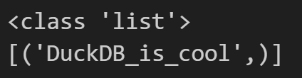
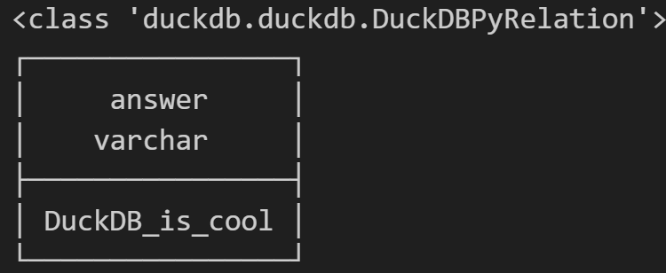
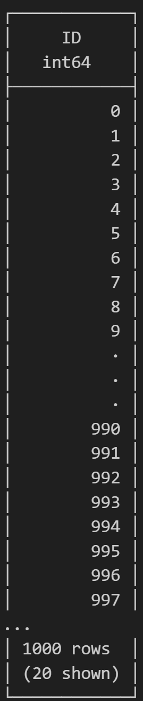
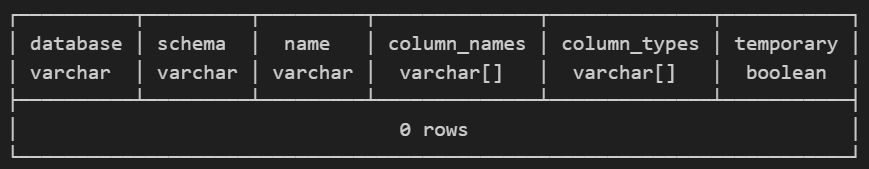
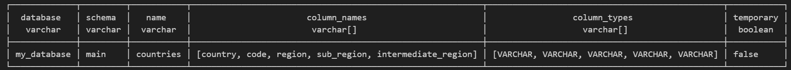
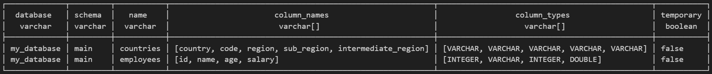

# Using DuckDB in Python: A Comprehensive Guide

### Introduction to DuckDB

DuckDB is a high-performance, in-memory/in-process analytical database management system designed to execute complex analytical SQL queries fast, efficiently, and reliably over large datasets. It is often referred to as the "SQLite for analytics" due to its lightweight nature and ease of integration, making it ideal for analytics tasks, able to run entirely in memory or within an application.

It basically means that, DuckDB can process data fast, similar to traditional databases like PostgreSQL or SQLite, but without the need for an external server process. DuckDB is particularly well-suited for data analysis tasks, making it a powerful tool for data scientists and analysts.

### **Why DuckDB?**

* **In-Process DB** : DuckDB can be embedded directly into your Python environment, which means you don't need to manage a separate database server.
* **Columnar Storage** : It stores data in a columnar format, optimized for analytical queries.
* **SQL support** : DuckDB fully supports SQL queries, making it easy to interact with large datasets using well-known SQL syntax.
* **Fast and efficient** : DuckDB is designed for speed, particularly for analytical workloads like large aggregations or filtering operations.
* **Compatible with Pandas, Parquet, and Arrow** : It supports modern data formats, enabling seamless interaction with other data science libraries.

Let's explore how to use DuckDB in Python, going from installation to performing various operations like loading data, querying, and interacting with other Python libraries.

### Installation

To get started with DuckDB in Python, you need to install the DuckDB Python package. You can do this using `pip` or `conda`, depending on your environment:

```bash
pip install duckdb
```

or

```bash
conda install python-duckdb -c conda-forge
```

### Creating a DuckDB Database

In DuckDB, databases are either stored as files or kept `***in-memory`, which can be created like this.

```python
import duckdb as dd

# Create an in-memory DuckDB connection
con = dd.connect(':memory:')
```

This command creates an in-memory database, meaning all operations are performed in the memory and won't persist after the session ends.

Alternatively, you can create a **persistent** DuckDB database by specifying a file path:

```python
# Create a persistent DuckDB database
con = dd.connect('my_database.db')
```

This stores the database in the file `my_database.db` in the current working directory, on your disk, making it persistent between sessions.

### Basic Usage

Once installed, you can start using DuckDB to run SQL queries directly within your Python environment. Here's a simple example:

```python
import duckdb as dd

# Running a basic SQL query
result = dd.sql("SELECT 'DuckDB_is_cool' AS answer").fetchall()
print( type(result) )		# <class 'list'>	# List of Tuples
print(result)
```



```python
import duckdb as dd

# Running a basic SQL query
relation = dd.sql("SELECT 'DuckDB_is_cool' AS answer")
print( type(relation) )		# <class 'duckdb.duckdb.DuckDBPyRelation'>	# This class represents a symbolic representation of SQL queries, known as a "relation".
print(relation)
```



Write simple SQL with DuckDB in Python: Example 3

```python
import duckdb as db

# Create a relation from a SQL query
rel = db.sql("SELECT * FROM range(10_00) AS tbl(ID)")
# Display the relation
rel.show()
```



## Running SQL Queries & Data Ingestion

DuckDB supports standard SQL syntax, so you can run any SQL query with ease. Let's start by creating a on file DataBase and looking at it.

```python
import duckdb as dd

# Create / connect to database
con = dd.connect('my_database.db')
con.sql('SHOW ALL TABLES)
```



Let's create a table and insert some data manually.

```python
import duckdb as dd

# Create / connect to database
con = dd.connect('my_database.db')

# Create a table
con.execute('''
CREATE TABLE countries (
    country VARCHAR,
    code VARCHAR,
    region VARCHAR,
    sub_region VARCHAR,
    intermediate_region VARCHAR
);
''')

# Insert data in table
con.execute('''
INSERT INTO countries VALUES
('Australia', 'AUS', 'Oceania', 'Australia and New Zealand', ''),
('India', 'IND', 'Asia', 'Southern Asia', '');
''')

```

```python
# Result of show tables after creating a table
con.sql('SHOW ALL TABLES')
```



Example 2: Creating a Table and Inserting Data Manually

```python
# Create second table
con.execute('''
CREATE TABLE employees (
    id INTEGER,
    name VARCHAR,
    age INTEGER,
    salary DOUBLE
);
''')

# Insert some data in second table
con.execute('''
INSERT INTO employees VALUES
(1, 'Person 1', 30, 70000),
(2, 'Person 2', 25, 55000),
(3, 'Person 3', 35, 80000);
''')
```

```python
# Result of show tables after creating a table
con.sql('SHOW ALL TABLES')
```




#### **Ingesting and Working with Data directly from files**

In the above examples we saw, DuckDB gives us the capability to create tables and allows us to manually add data to them. However, if we are talking about large sets of data, we can ingest data from a variety of sources, including CSV, Parquet, JSON, etc. files. DuckDB lets us capture and store this data in a database. Let’s start by removing the data added manually to the countries table.

```python
con.sql('DELETE FROM countries;')
con.sql('SELECT * FROM countries;')
```


Now, let’s insert all the values from the *countires.csv* file directly into the table and see how the data looks afterwards.

```python
con.sql('''
        INSERT INTO countries (country, code, region, sub_region, intermediate_region) 
        (SELECT * FROM "countries.csv")
''')
con.sql('SELECT * FROM countries LIMIT 5;')
```


#### **Working with persistent data stored in files**

Once the data is stored in tables as persistent data, we can work with it using standard SQL.

```python
con.sql('''
        SELECT  *
            FROM
                countries
            WHERE
                region = 'Oceania'
                AND sub_region = 'Australia and New Zealand'
''')
```


#### **Working with Data directly from files**

While DuckDB can ingest data from various formats, as discussed above. DuckDB also gives a provision to read from these files into an in-memory DuckDB relation (table) and query them directly, to explore and work with data.

```python
relation = con.sql('''
        SELECT  *
            FROM
                'countries.csv'
            WHERE
                region = 'Oceania'
                AND "sub-region" = 'Polynesia'
''')
relation
```


These are known as DuckDB relation objects. We can display all data in these `***relations***`, as demonstrated above of extract them as a list of tuples using `***fetchall***` method of these relations.

```python
relation.fetchall()
```


#### Integrating with Pandas

One of DuckDB’s most powerful features is its compatibility with `Pandas` (and other libraries like Polars etc.). You can run SQL queries directly on Pandas DataFrames or convert query results into DataFrames.

Example: Converting to Pandas DataFrames

```python
relation.to_df()
```


Example: Querying Pandas DataFrames directly

```python
import pandas as pd

df = pd.DataFrame({
    'id': [4, 5, 6],
    'name': ['Person 4', 'Person 5', 'Person 6'],
    'age': [45, 40, 35],
    'salary': [100000, 85000, 75000]
})

con.sql('''
        INSERT INTO employees (id, name, age, salary)
        SELECT * FROM df
''')

con.sql('select * from employees')
```


As you saw, DuckDB allows you to run SQL queries directly on a Pandas DataFrame. And as you would have guessed, you can convert query results back into DataFrames using .df().

```python
con.sql('SELECT * FROM df').df()
```


#### Working with Parquet and Arrow

DuckDB also supports efficient handling of Parquet and Arrow formats, commonly used in big data scenarios. You can read data from Parquet files and run SQL queries on them without first loading them into memory, as well.

Example: Reading from Parquet Files

```python
# Read data from a Parquet file
con.sql("SELECT * FROM 'countries.parquet'").df().head()
```

Similarly, DuckDB integrates well with Apache Arrow and supports operations on Arrow tables.

#### Advanced Queries and Using DuckDB for Analytical Workloads

DuckDB is optimized for performance, especially for analytical queries. DuckDB’s architecture, particularly its use of vectorized execution and columnar storage, helps DuckDB to speed up query processing and make it extremely efficient for data analytics. Additionally, DuckDB can operate directly on compressed data formats like Parquet, reducing the need for data decompression.

***Window Functions:*** You can perform windowing operations (e.g., running totals, moving averages).
***Group By:*** Complex group-by operations with large datasets are optimized.
***Parallel Execution:*** DuckDB automatically parallelizes many operations for faster results on large datasets.

Example: Group and count countries by their regions.

```python
con.sql('''
        SELECT  region
                , COUNT(DISTINCT country) AS country_counts
            FROM
                countries
            GROUP BY
                region
            ORDER BY
                country_counts DESC
''')
```


Example: Calculate the average salary and find people with above avg salary.

```python
# Writing CTE's
con.sql('''
        WITH avg_salary AS (
            SELECT
                    ROUND(AVG(salary),2) AS avg_salary
                FROM
                    employees
            )

        SELECT
                *
            FROM
                employees
            WHERE
                salary > (SELECT avg_salary FROM avg_salary)

''')
```


#### Speed Comparison: DuckDB vs Pandas

DuckDB and Pandas are both popular tools for data manipulation in Python, but they have different strengths. Pandas is a general-purpose data manipulation library optimized for in-memory operations, whereas DuckDB is designed specifically for high-performance, analytical queries on large datasets using SQL. DuckDB’s columnar storage and query optimization techniques make it significantly faster than Pandas for complex and large-scale analytical queries.

#### Why is DuckDB Faster for Analytical Queries?

***Columnar Storage:*** DuckDB stores data in a columnar format, which is more efficient for analytical queries (like filtering and aggregations). Pandas stores data in row-major format, which is better for general-purpose operations but can be slower for these specific tasks.

***Query Optimization:*** DuckDB uses query optimizations like predicate pushdown, efficient joins, and parallel query execution, which are typically missing or less efficient in Pandas.

***Parallel Execution:*** DuckDB can automatically parallelize complex queries, leveraging multiple cores in modern CPUs, while Pandas processes data mostly single-threaded by default.

***On-Disk Storage:*** DuckDB efficiently handles datasets that don’t fit into memory by using on-disk storage formats like Parquet, while Pandas requires that all data fit into memory.

#### Closing the Connection:

> Once you're done with your queries, always remember to close the DuckDB connection.

```python
con.close()
```

#### Conclusion

DuckDB is a powerful tool for performing efficient SQL operations in Python, especially when working with large datasets or complex analytical queries. Its ease of integration with modern data formats like Pandas, Parquet, and Arrow, combined with its fast performance, makes it a valuable addition to any data analyst’s toolkit.

Whether you’re building an in-memory database for fast analytics, working with small datasets, or working with large-scale data in Parquet files, DuckDB can simplify the process and accelerate performance. Its SQL syntax is easy to learn, and its compatibility with Python makes it highly flexible for a wide range of data-related tasks.

Want to learn more about DuckDB, Visit [DuckDB Python API](https://duckdb.org/docs/api/python/overview)

Want to access Jupyter Notebook and files, use my [GitHub Repo](https://github.com/AnshuBantra/Articles/tree/main/Medium/007).
